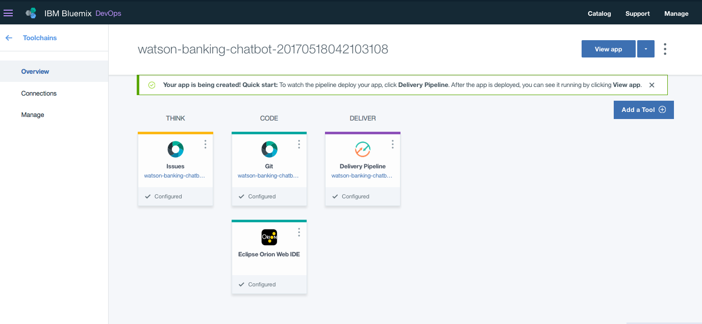

# Create a banking chatbot for RPA
In this developer journey, we will create a chatbot using Node.js and Watson Assistant. 

Learn how to

* Create a chatbot that converses via a web UI using Watson Assistant and Node.js

Final State architecture


## Flow
1. The user interacts with a chatbot via the app UI.
2. The dialogs is hardcoded to answer specific questions but will be enhanced to use other features like Watson Conversation, database interactons as we movealong this journey.

## Included components

* [IBM Watson Assistant](https://www.ibm.com/watson/developercloud/conversation.html): Build, test and deploy a bot or virtual agent across mobile devices, messaging platforms, or even on a physical robot.

## Featured technologies
* [Node.js](https://nodejs.org/): An asynchronous event driven JavaScript runtime, designed to build scalable applications.

# Steps

## Deploy to IBM Cloud
[](https://bluemix.net/deploy?repository=https://github.com/IBM/watson-banking-chatbot.git)

1. Press the above ``Deploy to IBM Cloud`` button and then click on ``Deploy``.

2. In Toolchains, click on ``Delivery Pipeline`` to watch while the app is deployed. Once deployed, the app can be viewed by clicking ``View app.


3. To see the app and services created and configured for this journey, use the Bluemix dashboard. The app is named `watson-banking-chatbot` with a unique suffix. The following services are created and easily identified by the `wbc-` prefix:
    * wbc-conversation-service
    * wbc-discovery-service
    * wbc-natural-language-understanding-service
    * wbc-tone-analyzer-service

## Run locally
> NOTE: These steps are only needed when running locally instead of using the ``Deploy to IBM Cloud`` button.

1. [Clone the repo](#1-clone-the-repo)
2. [Create Watson services with IBM Cloud](#2-create-watson-services-with-ibm-bluemix)
3. [Import the Watson Assistant workspace](#3-import-the-conversation-workspace)
4. [Load the Discovery documents](#4-load-the-discovery-documents)
5. [Configure credentials](#5-configure-credentials)
5. [Run the application](#6-run-the-application)

### 1. Clone the repo

Clone the `watson-banking-chatbot` locally. In a terminal, run:

```
$ git clone https://github.com/IBM/watson-banking-chatbot
```

We’ll be using the file [`data/conversation/workspaces/banking.json`](data/conversation/workspaces/banking.json) and the folder
[`data/conversation/workspaces/`](data/conversation/workspaces/)

### 2. Create Watson services with IBM Cloud

Create the following services:

* [**Watson Assistant**](https://console.ng.bluemix.net/catalog/services/conversation)
* [**Watson Discovery**](https://console.ng.bluemix.net/catalog/services/discovery)
* [**Watson Tone Analyzer**](https://console.ng.bluemix.net/catalog/services/tone-analyzer)
* [**Watson Natural Language Understanding**](https://console.ng.bluemix.net/catalog/services/natural-language-understanding)

### 3. Import the Assistant workspace

Launch the **Watson Assistant** tool. Use the **import** icon button on the right

<p align="center">
  
</p>

Find the local version of [`data/conversation/workspaces/banking.json`](data/conversation/workspaces/banking.json) and select
**Import**. Find the **Workspace ID** by clicking on the context menu of the new
workspace and select **View details**. Save this ID for later.

<p align="center">
  
</p>

*Optionally*, to view the conversation dialog select the workspace and choose the
**Dialog** tab, here's a snippet of the dialog:


### 4. Load the Discovery documents

Launch the **Watson Discovery** tool. Create a **new data collection**
and give the data collection a unique name.

<p align="center">
  
</p>

> Save the **environment_id** and **collection_id** for your `.env` file in the next step.

Under `Add data to this collection` use `Drag and drop your documents here or browse from computer` to seed the content with the five documents in `data/discovery/docs`.

### 5. Configure credentials

The credentials for IBM Cloud services (Assistant, Discovery, Tone Analyzer and
Natural Language Understanding), can be found in the ``Services`` menu in IBM Cloud,
by selecting the ``Service Credentials`` option for each service.

The other settings for Assistant and Discovery were collected during the
earlier setup steps (``DISCOVERY_COLLECTION_ID``, ``DISCOVERY_ENVIRONMENT_ID`` and
``WORKSPACE_ID``).

Copy the [`env.sample`](env.sample) to `.env`.

```
$ cp env.sample .env
```
Edit the `.env` file with the necessary settings.

#### `env.sample:`

```
# Replace the credentials here with your own.
# Rename this file to .env before starting the app.

# Watson conversation
CONVERSATION_USERNAME=<add_conversation_username>
CONVERSATION_PASSWORD=<add_conversation_password>
WORKSPACE_ID=<add_conversation_workspace>

# Watson Discovery
DISCOVERY_USERNAME=<add_discovery_username>
DISCOVERY_PASSWORD=<add_discovery_password>
DISCOVERY_ENVIRONMENT_ID=<add_discovery_environment>
DISCOVERY_COLLECTION_ID=<add_discovery_collection>

# Watson Natural Language Understanding
NATURAL_LANGUAGE_UNDERSTANDING_USERNAME=<add_nlu_username>
NATURAL_LANGUAGE_UNDERSTANDING_PASSWORD=<add_nlu_password>

# Watson Tone Analyzer
TONE_ANALYZER_USERNAME=<add_tone_analyzer_username>
TONE_ANALYZER_PASSWORD=<add_tone_analyzer_password>

# Run locally on a non-default port (default is 3000)
# PORT=3000

```

### 6. Run the application
1. Install [Node.js](https://nodejs.org/en/) runtime or NPM.
1. Start the app by running `npm install`, followed by `npm start`.
1. Use the chatbot at `localhost:3000`.
> Note: server host can be changed as required in server.js and `PORT` can be set in `.env`.

# Sample output


# Links

* [Demo on Youtube](https://www.youtube.com/watch?v=Jxi7U7VOMYg)
* [Watson Node.js SDK](https://github.com/watson-developer-cloud/node-sdk)
* [Relevancy Training Demo Video](https://www.youtube.com/watch?v=8BiuQKPQZJk)
* [Relevancy Training Demo Notebook](https://github.com/akmnua/relevancy_passage_bww)

# Troubleshooting

* Error: Environment {GUID} is still not active, retry once status is active

  > This is common during the first run. The app tries to start before the Discovery
environment is fully created. Allow a minute or two to pass. The environment should
be usable on restart. If you used `Deploy to IBM Cloud` the restart should be automatic.

* Error: Only one free environment is allowed per organization

  > To work with a free trial, a small free Discovery environment is created. If you already have
a Discovery environment, this will fail. If you are not using Discovery, check for an old
service thay you may want to delete. Otherwise use the .env DISCOVERY_ENVIRONMENT_ID to tell
the app which environment you want it to use. A collection will be created in this environment
using the default configuration.

# License
[Apache 2.0](LICENSE)

# Privacy Notice
If using the `Deploy to IBM Cloud` button some metrics are tracked, the following
information is sent to [Deployment Tracker](https://github.com/IBM-Bluemix/cf-deployment-tracker-service) and
[Metrics collector](https://github.com/IBM/metrics-collector-service) service on each deployment:

* Node.js package version
* Node.js repository URL
* Application Name (`application_name`)
* Application GUID (`application_id`)
* Application instance index number (`instance_index`)
* Space ID (`space_id`)
* Application Version (`application_version`)
* Application URIs (`application_uris`)
* Cloud Foundry API (`cf_api`)
* Labels of bound services
* Number of instances for each bound service and associated plan information
* Metadata in the repository.yaml file

This data is collected from the `package.json` and `repository.yaml` file in the sample application and the `VCAP_APPLICATION` and `VCAP_SERVICES` environment variables in IBM Cloud and other Cloud Foundry platforms. This data is used by IBM to track metrics around deployments of sample applications to IBM Cloud to measure the usefulness of our examples, so that we can continuously improve the content we offer to you. Only deployments of sample applications that include code to ping the Deployment Tracker service will be tracked.

## Disabling Deployment Tracking

To disable tracking, simply remove ``require("cf-deployment-tracker-client").track();`` and ``require('metrics-tracker-client').track();`` from the ``app.js`` file in the top level directory.
